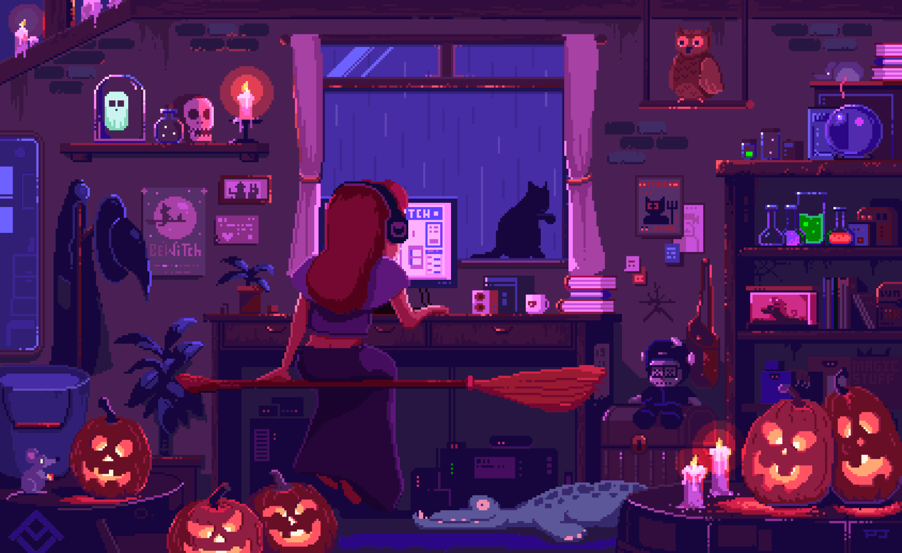

  

#

  Estudante de Análise e Desenvolvimento de Sistemas, com paixão por Dados, Inteligência Artificial e tecnologia. 
   
  Minha jornada me proporcionou uma base sólida tanto no desenvolvimento de software quanto na engenharia de dados. Busco sempre aplicar meus conhecimentos para criar soluções inovadoras.

  
 

<h3 align="left">Conecte-se comigo!</h3>

  
  

<h3 align="left">Tech Stack</h3>

  
  
  
  
   
  
  
  
  
  
  
  
  
  
  
  
  
  
  

 

#

### Minhas Estatísticas do GitHub

  

#

<picture align="center">
  <source media="(prefers-color-scheme: dark)" srcset="https://raw.githubusercontent.com/GabrielaHSantos/GabrielaHSantos/output/github-contribution-grid-snake-dark.svg">
  <source media="(prefers-color-scheme: light)" srcset="https://raw.githubusercontent.com/GabrielaHSantos/GabrielaHSantos/output/github-contribution-grid-snake.svg">
  
</picture>
